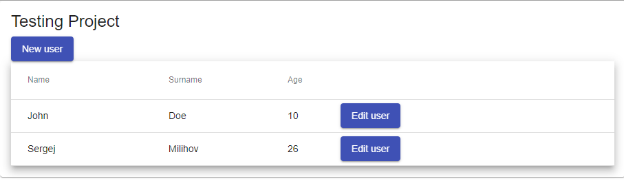
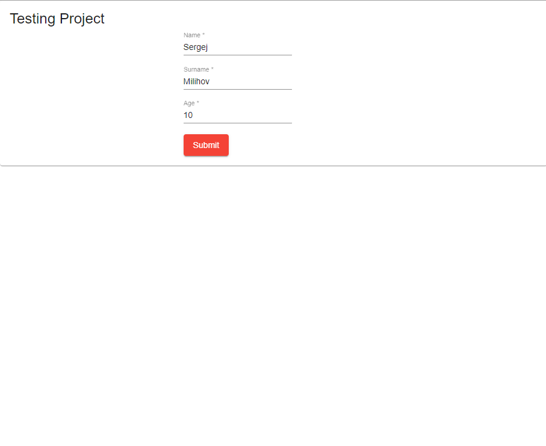
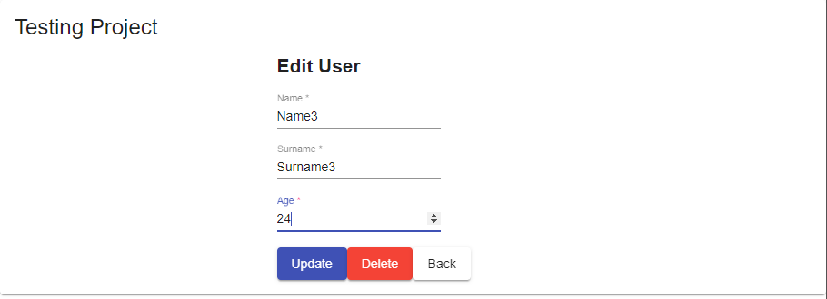

# Angular-Node-CURD-demo
 Angular + Node curd demo
 Using Angular Material

 # Install
 
 Frontend : 

 cd angular-material-demo
 npm install
 npm start

 Backend :

 cd node-js-server
 npm install
 npm start

 # Frontend

 User List Page
 

 Add New User
 

 Edit User
 
